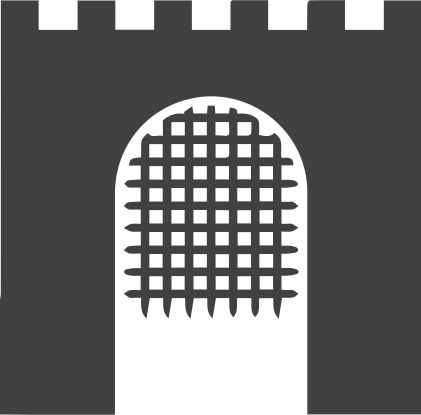

# Portcullis 
     
A golang application that waits for a TCP port be become available before gracefully exiting.

# Problem statement

If you need a `initContainer` which prevents application startup based on the availabity of a TCP port.

A simple use case example might be if you are using security groups for pods in Amazon AWS. Your services may fail until the interface has been attached to your Pod.

Portcullis also has functionality to avoid the thundering herd issue which is amplified when using GitOps principles. 
